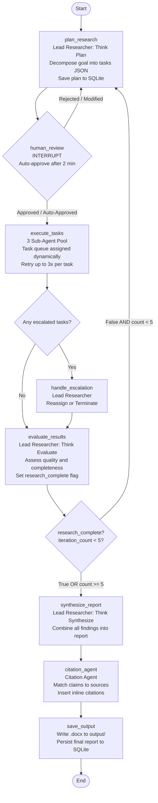

# Graph Design — Multi-Agent Research System

> This document is the authoritative design reference for the LangGraph state graph. It defines every node, edge, conditional routing rule, and the complete state structure. All implementation in `nodes.py`, `edges.py`, `state.py`, and `builder.py` must align with this design.

---

## 1. Graph Flow — Mermaid Diagram

> Paste the code block below into [mermaid.live](https://mermaid.live) to visualize the graph.




---

## 2. Node Definitions

Each node maps directly to a function in `src/app/graph/nodes.py`.

---

### Node 1 — `plan_research`

**Agent:** Lead Researcher
**Phase:** Think (Plan Approach)
**File:** `nodes.py → plan_research_node(state)`

**What it does:**

- Reads `research_goal` and any `human_feedback` from state
- If this is a re-plan (human rejected or more research needed), reads prior context from SQLite to avoid duplicating completed work
- Calls Groq LLM with the planning prompt to decompose the goal into a JSON task list
- Validates the JSON task list structure (see Task Schema below)
- Increments `iteration_count`
- Writes the plan to SQLite (session persistence)
- Updates `tasks` in state

**Reads from state:** `research_goal`, `human_feedback`, `iteration_count`, `sub_agent_results` (on re-plan)
**Writes to state:** `tasks`, `iteration_count`, `human_approved` (reset to False)

---

### Node 2 — `human_review`

**Type:** LangGraph Interrupt (Human-in-the-Loop) with Auto-Approve Timeout
**File:** `nodes.py → human_review_node(state)` — uses `interrupt()`

**What it does:**

- Pauses graph execution via LangGraph's  and @graph_[design.md Try to look into both the files and try to start writing the code for me. Initially, what you need to do is start building the Graph part. Start writing one file at a time. Once that file is written, let me know or interrupt for my output. I will look into the code and then I'll say whether that is correct or not. For now, only implement the graph. Take all sincerity whenever you are building state nodes, edges, problems builder, all these files, and use the updated lang graphs ingredients. See what is the updated lang graph, the lang graph version that we are having, and then use all the functions from the updated lang graph.](http://design.md)mechanism
- Presents the formatted task list to the user
- Waits up to **2 minutes (120 seconds)** for user response — configured via `HUMAN_REVIEW_TIMEOUT_SECONDS` in `config.py`
- User can respond with one of:
  - `approve` — proceed to execution as-is
  - `modify` — provide an updated task list or feedback string, then re-plan
  - `reject` — send feedback and go back to planning

**Timeout behavior:**

- A background timer is started when `interrupt()` is called
- If the user does not respond within 120 seconds, the node resumes automatically
- On timeout: `human_approved` is set to `True`, a note is appended to `error_log` recording the auto-approval, and execution proceeds to `execute_tasks`
- This ensures the pipeline never stalls indefinitely waiting for human input

**Reads from state:** `tasks`
**Writes to state:** `human_approved`, `human_feedback`, `error_log` (on timeout)

---

### Node 3 — `execute_tasks`

**Agent:** 3 Fixed Sub-Agents (pool model)
**File:** `nodes.py → execute_tasks_node(state)` — uses `asyncio` with a worker pool of 3

**Design — Fixed Pool of 3 Sub-Agents:**

Rather than spawning one sub-agent per task (unbounded), the system maintains exactly **3 sub-agents** (`sub_agent_1`, `sub_agent_2`, `sub_agent_3`) configured via `MAX_SUB_AGENTS = 3` in `config.py`. Tasks are loaded into a shared queue at the start of execution. Each sub-agent pulls the next available task from the queue as soon as it finishes its current one.

**Example — 6 tasks across 3 agents:**

```
Task Queue:  [T1, T2, T3, T4, T5, T6]

sub_agent_1:  T1 → done → picks T4 → done → idle
sub_agent_2:  T2 → done → picks T5 → done → idle
sub_agent_3:  T3 → done → picks T6 → done → idle

All 3 run in parallel. Assignment is dynamic — a faster agent
picks up the next queued task immediately, not pre-assigned.
```

**What each sub-agent does per task:**

- Receives one task dict from the queue
- Calls Tavily web search using the task's `search_queries`
- Processes any `relevant_documents` from user-provided sources
- Structures findings into a result dict
- Retries up to 3 times on any tool or LLM failure
- If still failing after 3 retries: marks result as `escalated` and moves to next task

**Fan-in — collecting results:**

- All results are gathered once all 3 agents are idle and the queue is empty
- Results are appended to `sub_agent_results`
- All source URLs are aggregated into `all_sources`
- Tasks with `escalated` status are moved to `escalated_tasks`

**Reads from state:** `tasks`, `user_documents`
**Writes to state:** `sub_agent_results`, `all_sources`, `escalated_tasks`

---

### Node 4 — `handle_escalation`

**Agent:** Lead Researcher
**File:** `nodes.py → handle_escalation_node(state)`

**What it does:**

- Receives the list of `escalated_tasks` from state
- For each escalated task, calls Groq LLM to decide:
  - **Reassign** — generate a simplified or reworded version of the task and add it back to the pending task list (will be executed in the next sub-agent pass)
  - **Terminate** — mark the task as permanently failed, log it in `error_log`, continue without it
- Updates the task list and logs all decisions

**Reads from state:** `escalated_tasks`, `tasks`
**Writes to state:** `tasks` (modified), `error_log`

---

### Node 5 — `evaluate_results`

**Agent:** Lead Researcher
**Phase:** Think (Evaluate)
**File:** `nodes.py → evaluate_results_node(state)`

**What it does:**

- Retrieves prior research context from SQLite (previous iterations' findings and plans)
- Calls Groq LLM with all `sub_agent_results` and evaluation prompt
- Assesses each result for:
  - Quality — is the finding substantive and accurate?
  - Completeness — does it fully address the task?
  - Relevance — does it contribute to the research goal?
- Writes `evaluation_notes` summarizing gaps and strengths
- Sets `research_complete = True` if the research goal is sufficiently addressed, `False` if more is needed

**Reads from state:** `sub_agent_results`, `research_goal`, `iteration_count`
**Writes to state:** `evaluation_notes`, `research_complete`

---

### Node 6 — `synthesize_report`

**Agent:** Lead Researcher
**Phase:** Think (Synthesize Results)
**File:** `nodes.py → synthesize_report_node(state)`

**What it does:**

- Retrieves all accumulated findings across all iterations from SQLite
- Calls Groq LLM with all `sub_agent_results`, `evaluation_notes`, and synthesis prompt
- Produces a cohesive, detailed `synthesized_report` — narrative prose, structured sections, no raw search dumps
- Persists the synthesized report to SQLite (crash recovery)

**Reads from state:** `sub_agent_results`, `evaluation_notes`, `research_goal`
**Writes to state:** `synthesized_report`

---

### Node 7 — `citation_agent`

**Agent:** Citation Agent
**File:** `nodes.py → citation_agent_node(state)`

**What it does:**

- Receives `synthesized_report` and `all_sources`
- Calls Groq LLM with the citation prompt
- Identifies every factual claim or data point in the report
- Matches each claim to the most relevant source URL or document
- Inserts inline citations in the format `[Source N]` with a numbered reference list appended
- Returns the complete `final_report`

**Reads from state:** `synthesized_report`, `all_sources`, `user_documents`
**Writes to state:** `final_report`

---

### Node 8 — `save_output`

**File:** `nodes.py → save_output_node(state)`

**What it does:**

- Takes `final_report` string and renders it as a formatted `.docx` file using `python-docx`
- Saves the file to the `output/` directory with a timestamped filename
- Writes the file path to `output_path` in state
- Persists `output_path` and `final_report` to SQLite for cross-session recovery

**Reads from state:** `final_report`
**Writes to state:** `output_path`

---

## 3. Edge Definitions

All routing logic lives in `src/app/graph/edges.py`.

---

### Direct Edges (unconditional)


| From                | To                 | Description                                    |
| ------------------- | ------------------ | ---------------------------------------------- |
| `START`             | `plan_research`    | Graph entry point                              |
| `plan_research`     | `human_review`     | Always pause for human approval after planning |
| `handle_escalation` | `evaluate_results` | Always evaluate after handling failures        |
| `synthesize_report` | `citation_agent`   | Always add citations after synthesis           |
| `citation_agent`    | `save_output`      | Always save after citation                     |
| `save_output`       | `END`              | Graph exit                                     |


---

### Conditional Edges

#### Edge 1 — After `human_review`

**Function:** `route_human_review(state) -> str`


| Condition                          | Next Node       | Description                         |
| ---------------------------------- | --------------- | ----------------------------------- |
| `state["human_approved"] == True`  | `execute_tasks` | User approved — proceed to research |
| `state["human_approved"] == False` | `plan_research` | User rejected or modified — replan  |


---

#### Edge 2 — After `execute_tasks`

**Function:** `route_after_execution(state) -> str`


| Condition                            | Next Node           | Description                                  |
| ------------------------------------ | ------------------- | -------------------------------------------- |
| `len(state["escalated_tasks"]) > 0`  | `handle_escalation` | Failures exist — Lead Researcher must decide |
| `len(state["escalated_tasks"]) == 0` | `evaluate_results`  | All tasks resolved — move to evaluation      |


---

#### Edge 3 — After `evaluate_results`

**Function:** `route_research_loop(state) -> str`


| Condition                                                                | Next Node           | Description                                |
| ------------------------------------------------------------------------ | ------------------- | ------------------------------------------ |
| `state["research_complete"] == False` AND `state["iteration_count"] < 5` | `plan_research`     | More research needed and iterations remain |
| `state["research_complete"] == True` OR `state["iteration_count"] >= 5`  | `synthesize_report` | Goal met or iteration cap hit — synthesize |


> **Note:** When `iteration_count >= 5` forces exit, a warning is written to `error_log` noting the forced termination.

---

## 4. State Structure

Defined in `src/app/graph/state.py` as a `TypedDict`.

```
ResearchState
│
├── research_goal: str
│       The raw research goal submitted by the user.
│
├── user_documents: list[str]
│       File paths or URLs of PDFs/links provided by the user.
│       Empty list if no documents provided.
│
├── tasks: list[dict]
│       The current active task list (see Task Schema below).
│       Overwritten on each re-plan.
│
├── human_feedback: str
│       User's modification notes from the human_review interrupt.
│       Empty string if user approved without changes.
│
├── human_approved: bool
│       True if user approved the task list. False triggers re-planning.
│       Also set to True automatically on 2-minute timeout.
│
├── iteration_count: int
│       Number of research loops completed. Starts at 0. Max is 5.
│
├── sub_agent_results: list[dict]
│       Accumulated results from all sub-agents across all iterations.
│       (see Sub-Agent Result Schema below)
│
├── all_sources: list[str]
│       All source URLs and document paths collected by sub-agents.
│       Accumulated across all iterations for citation use.
│
├── escalated_tasks: list[dict]
│       Tasks that exhausted 3 retries and could not be completed.
│       Cleared after handle_escalation processes them.
│
├── evaluation_notes: str
│       Lead Researcher's written evaluation of sub-agent results.
│       Overwritten each iteration.
│
├── research_complete: bool
│       Set by evaluate_results. True = goal sufficiently addressed.
│       False = more research needed.
│
├── synthesized_report: str
│       Pre-citation unified research report from synthesize_report node.
│
├── final_report: str
│       Synthesized report with citations inserted by citation_agent.
│
├── output_path: str
│       File path to the saved .docx report. Set by save_output node.
│
└── error_log: list[str]
        Log of all errors, escalations, and forced terminations.
```

---

## 5. Task JSON Schema

This is the structure of each item inside `state["tasks"]`. The Lead Researcher generates this JSON at the `plan_research` node.

```
Task Object
│
├── task_id: str            — UUID, unique per task
├── title: str              — Short descriptive title
├── description: str        — Full task instructions for the sub-agent
├── search_queries: list[str]  — 2-4 search strings the sub-agent should use
├── relevant_documents: list[str]  — Subset of user_documents relevant to this task
├── priority: str           — "high" | "medium" | "low"
├── status: str             — "pending" | "in_progress" | "completed" | "failed" | "escalated"
├── retry_count: int        — Number of retries attempted (0-3)
└── assigned_to: str        — Sub-agent identifier (set during execution)
```

---

## 6. Sub-Agent Result Schema

This is the structure of each item inside `state["sub_agent_results"]`.

```
Sub-Agent Result Object
│
├── task_id: str            — Links back to the originating task
├── findings: str           — Narrative summary of research findings
├── sources: list[str]      — URLs and documents consulted
├── status: str             — "completed" | "failed" | "escalated"
├── retry_count: int        — How many retries were needed
└── error_message: str      — Error details if status is failed/escalated, else null
```

---

## 7. SQLite Memory — What Gets Persisted

The SQLite layer (in `data/research_context/session_store.py`) persists the following for cross-session recovery:


| Data                               | When Written              | When Read                                      |
| ---------------------------------- | ------------------------- | ---------------------------------------------- |
| Research goal                      | On graph start            | On resume                                      |
| Task plans (all iterations)        | After `plan_research`     | During `evaluate_results`, `synthesize_report` |
| Sub-agent results (all iterations) | After `execute_tasks`     | During `evaluate_results`, `synthesize_report` |
| Evaluation notes                   | After `evaluate_results`  | During `synthesize_report`                     |
| Synthesized report                 | After `synthesize_report` | During `citation_agent`, recovery              |
| Final report + output path         | After `save_output`       | On recovery/resume                             |


> **Note:** LangGraph's built-in `SqliteSaver` checkpointer handles automatic state checkpointing at each node. The `session_store.py` layer is an additional application-level store for structured query access (e.g. "retrieve all task plans from prior iterations").

---

## 8. LangGraph-Specific Implementation Notes

- **Sub-Agent Pool:** `execute_tasks` uses `asyncio` with a fixed concurrency limit of 3 workers (`MAX_SUB_AGENTS = 3` in `config.py`). This is implemented as an async task queue — all pending tasks are loaded into a `asyncio.Queue`, and 3 worker coroutines each loop: pull task → execute → push result → repeat until queue empty. This is simpler and more predictable than the Send API fan-out approach and caps resource usage regardless of task count.
- **Human-in-the-Loop with Timeout:** `interrupt()` is called inside `human_review_node`. A `HUMAN_REVIEW_TIMEOUT_SECONDS = 120` value from `config.py` controls the wait window. If no response is received within 2 minutes, the node resumes automatically with `human_approved = True` and logs the auto-approval to `error_log`.
- **Checkpointing:** The graph is compiled with LangGraph's built-in `SqliteSaver` as the checkpointer. This automatically snapshots state after every node, enabling crash recovery and cross-session resume.
- **Application-Level SQLite (`session_store.py`):** A second, separate SQLite store handles structured queries across iterations — e.g. "retrieve all task plans from iterations 1 through 3". This is distinct from the checkpointer, which only stores raw state blobs.
- **Max Iteration Guard:** `route_research_loop` compares `iteration_count` against `MAX_ITERATIONS` (default 5, set in `config.py`). When the cap is hit, routing is forced to `synthesize_report` and a warning is appended to `error_log`.
- **Thread ID:** Each research session is assigned a unique `thread_id` passed as `graph.invoke(config={"configurable": {"thread_id": session_id}})`. This scopes all checkpointed state and SQLite entries to that session.

```

---

## 9. Node-to-File Mapping Summary

| Node | Function Name | File |
|---|---|---|
| `plan_research` | `plan_research_node` | `src/app/graph/nodes.py` |
| `human_review` | `human_review_node` | `src/app/graph/nodes.py` |
| `execute_tasks` | `execute_tasks_node` | `src/app/graph/nodes.py` |
| `handle_escalation` | `handle_escalation_node` | `src/app/graph/nodes.py` |
| `evaluate_results` | `evaluate_results_node` | `src/app/graph/nodes.py` |
| `synthesize_report` | `synthesize_report_node` | `src/app/graph/nodes.py` |
| `citation_agent` | `citation_agent_node` | `src/app/graph/nodes.py` |
| `save_output` | `save_output_node` | `src/app/graph/nodes.py` |
| `route_human_review` | `route_human_review` | `src/app/graph/edges.py` |
| `route_after_execution` | `route_after_execution` | `src/app/graph/edges.py` |
| `route_research_loop` | `route_research_loop` | `src/app/graph/edges.py` |
```

